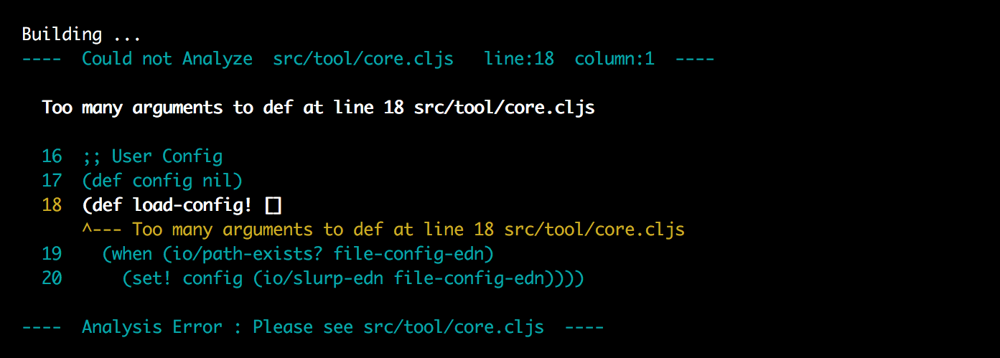
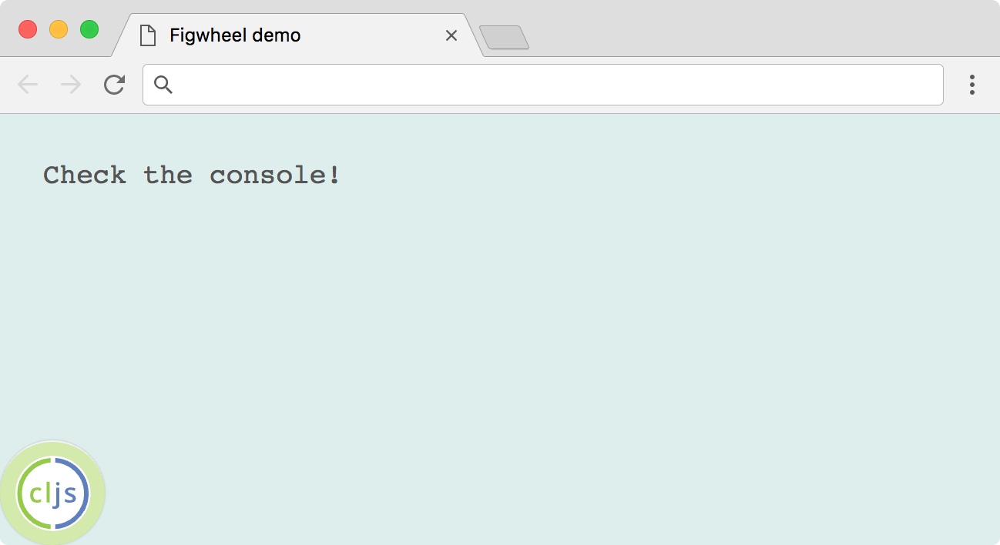
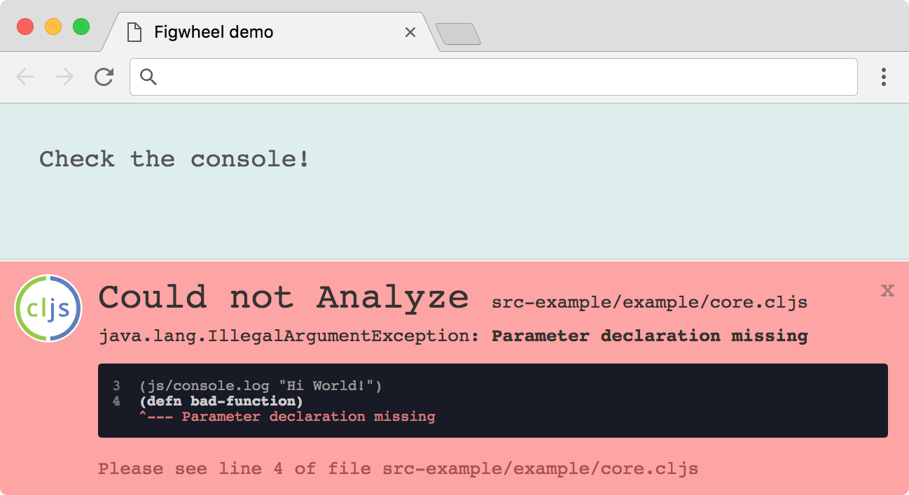
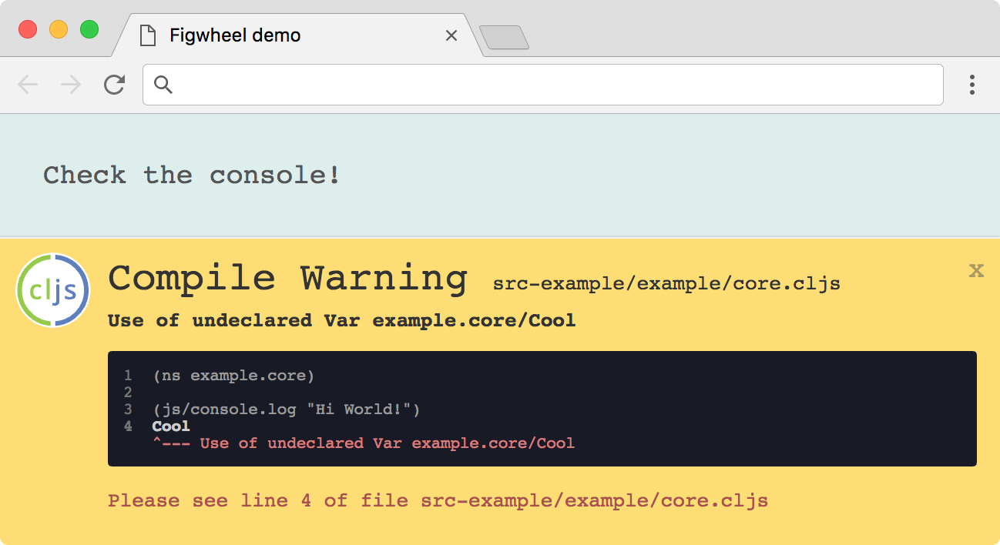

> __NOTE__: work in progress

# ClojureScript starter tool

A tool to answer the following questions:

- What would a great first run of ClojureScript look like?
- How do we create that in the clearest and cheapest way possible?
- Should it do everything?

## Install

```
$ npm install cljs/tool -g
```

This installs a `cljs` command, which is the abbreviation for ClojureScript.

## Basics

Using __[Lumo]__, fast experimenting is the default experience.
Try the most basic things as fast as possible.

- REPL

  ```
  $ cljs

  cljs.user=> (+ 1 2 3)
  6
  ```

- Run script

  ```clojure
  ;; my_file.cljs
  (println (+ 1 2 3))
  ```

  ```sh
  $ cljs my_file.cljs
  6
  ```

## Use dependencies

You can pull in external libraries by specifying them in a plain config file, `cljs.edn`.
Dependencies are automatically downloaded when running any `cljs` command or explicitly
with `cljs install`.

- Dependencies

  ```edn
  ;; cljs.edn
  {:dependencies
   [[markdown-clj "0.9.94"]]}
  ```

  ```clojure
  $ cljs

  cljs.user=> (require '[markdown.core :refer [md->html]])
  cljs.user=> (md->html "## Hello World")
  "<h2>Hello World</h2>"
  ```

- In Script

  ```clojure
  ;; my_file.cljs
  (require '[markdown.core :refer [md->html]])

  (println (md->html "## Hello World"))
  ```

  ```html
  $ cljs my_file.cljs
  <h2>Hello World</h2>
  ```

## Use Namespaces

If you create a build name that points to a source directory, you can
start organizing files into canonical namespaces.

- Specify src directory

  ```edn
  ;; cljs.edn
  {:dependencies [...]
   :builds {:main {:src "src"}}} ;; <-- Source at "src" directory,
                                 ;;     or use ["src" ...] for multiple.
                                 ;;     (:main can be any name for the build)
  ```

- Use namespaces

  ```clojure
  ;; src/example/core.cljs
  (ns example.core)

  (defn hello []
    (println "Hello World"))
  ```

  ```clojure
  $ cljs

  cljs.user=> (require 'example.core)
  cljs.user=> (in-ns 'example.core)
  example.core=> (hello)
  Hello World
  ```

## Compile to JavaScript

To run your ClojureScript code without the `cljs` command, you can
compile it to a JavaScript output file for use in a browser or elsewhere.
Specify extra config for compiler:

- Compiler config

  ```edn
  ;; cljs.edn
  {:cljs-version "1.9.456"  ;; <-- compiler version
   :dependencies [...]
   :builds {:main {:src "src"
                   :compiler {:output-to "main.js"}}}} ;; <-- compiler options
  ```

- Build or watch

  ```sh
  $ cljs build main
  $ cljs watch main
  ```

- Pretty errors _by [Figwheel Sidecar]_

  

Rather than using Lumo, we use the fast ClojureScript compiler optimized for the JVM,
with better default errors and warnings provided by [Figwheel Sidecar].

## Develop for the web

Using __[Figwheel]__, you can compile your project with a much more fluid and interactive
developer experience. You get a browser-connected REPL, hot-loading of files
as they change, and an in-page status display.

- Figwheel config

  ```edn
  ;; cljs.edn
  {:cljs-version "1.9.456"
   :dependencies [...]
   :figwheel {...} ;; <-- optional server-level config
   :builds {:main {:src "src"
                   :figwheel ... ;; <-- optional build-level config
                   :compiler {...}}}}
  ```

- Run Figwheel

  ```sh
  $ cljs figwheel main
  ```

> Try the example provided in this repo:
>
> ```sh
> $ cljs figwheel example
>
> cljs.user=>
> ```
>
> Open `public/index.html`, then modify `src-example/example/core.cljs` to see
> status messages on your page:
>
>   

## Customize build scripts

For direct access to the ClojureScript compiler API,
run with a Clojure file (`.clj` not `.cljs`).  
Your Clojure program will be given access to the compiler API and
your config in a `*cljs-config*` var.

- Custom Build

  ```clojure
  ;; build.clj
  (require '[cljs.build.api :as b]) ;; <-- official cljs compiler api

  (let [{:keys [src compiler]} (-> *cljs-config* :builds :main)]
    (b/build src compiler))
  ```

- Run

  ```
  $ cljs build.clj
  ```

[Lumo]:https://github.com/anmonteiro/lumo
[Figwheel Sidecar]:https://github.com/bhauman/lein-figwheel/tree/master/sidecar
[Figwheel]:https://github.com/bhauman/lein-figwheel
[Quick Start]:https://clojurescript.org/guides/quick-start
